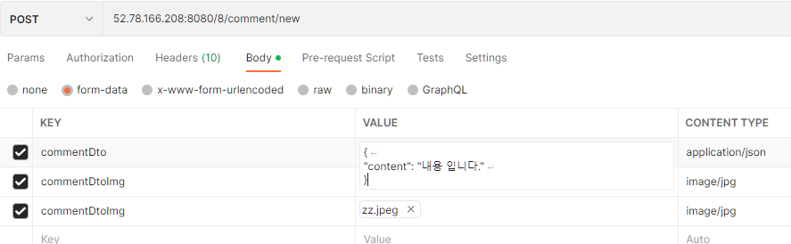

[[Comment-API]]
== 댓글 API

[[Comment-댓글-생성]]
=== 댓글 생성

operation::comment-create[snippets='http-request']

.요청값
[%collapsible]
====

=====
include::{snippets}/comment-create/request-parts.adoc[]

commentImgFile - 댓글 이미지 파일(FILE) +
.jpg 형식의 이미지 파일을 지원합니다.

include::{snippets}/comment-create/request-parameters.adoc[]

content - 댓글 내용(String) +
파라미터라고 써있지만 form-data에 넣어주시면 됩니다.

=====

====

operation::comment-create[snippets='http-response']

[[Comment-댓글-수정]]
=== 댓글 수정

==== HTTP request

include::{snippets}/comment-update/http-request.adoc[]

==== 요청값

====
include::{snippets}/comment-update/request-parts.adoc[]

commentDto - 댓글 수정 데이터(JSON)
include::{snippets}/comment-update/request-part-commentDto-fields.adoc[]

commentDtoImg - 댓글 수정 프로필 이미지(FILE) +
.jpg 형식의 이미지 파일을 지원합니다.

====

==== HTTP response

include::{snippets}/comment-update/http-response.adoc[]

[[Comment-댓글-삭제]]
=== 댓글 삭제

operation::comment-delete[snippets='http-request,path-parameters,http-response']

[[Comment-댓글-좋아요]]
=== 좋아요

==== HTTP request

include::{snippets}/comment-like/http-request.adoc[]

==== 요청값

====
include::{snippets}/comment-like/path-parameters.adoc[]

include::{snippets}/comment-like/request-parameters.adoc[]
====

==== HTTP response

include::{snippets}/comment-like/http-response.adoc[]

[[Comment-특정-챌린지의-댓글-조회]]
=== 특정 챌린지의 댓글 조회

==== HTTP request

include::{snippets}/search-comments-by-challengeId/http-request.adoc[]

==== 요청값

====
include::{snippets}/search-comments-by-challengeId/path-parameters.adoc[]

====

==== HTTP response

[%collapsible]
====
include::{snippets}/search-comments-by-challengeId/http-response.adoc[]
include::{snippets}/search-comments-by-challengeId/response-fields.adoc[]
====

[[Comment-특정-유저의-댓글-조회]]
=== 특정 유저의 댓글 조회

==== HTTP request

include::{snippets}/search-comments-by-userId/http-request.adoc[]

==== 요청값

====
include::{snippets}/search-comments-by-userId/path-parameters.adoc[]

====

==== HTTP response

[%collapsible]
====
include::{snippets}/search-comments-by-userId/http-response.adoc[]
include::{snippets}/search-comments-by-userId/response-fields.adoc[]
====